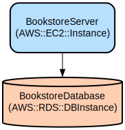

# Bookstore Management API: A Secure and Scalable User Management System

The Bookstore Management API is a RESTful service that provides robust user management capabilities for bookstore applications. Built with Go and the Gin web framework, it offers secure user authentication, profile management, and seamless database integration with PostgreSQL.

The API implements industry-standard security practices including JWT-based authentication, password hashing, and middleware protection for sensitive endpoints. It features a clean architecture with clear separation of concerns, comprehensive test coverage, and auto-generated Swagger documentation for easy API exploration and integration.

## Repository Structure
```
.
├── configs/                 # Configuration management for database and JWT settings
├── docs/                    # API documentation and infrastructure diagrams
│   ├── swagger.json        # OpenAPI/Swagger specification in JSON format
│   └── swagger.yaml        # OpenAPI/Swagger specification in YAML format
├── internal/               # Core application logic
│   └── users/             # User management domain
│       ├── api/           # HTTP handlers and DTOs
│       ├── user.model.go  # User entity definition
│       ├── user.repository.go # Data access layer
│       └── user.service.go    # Business logic layer
├── middleware/            # HTTP middleware including JWT authentication
├── migrations/           # Database migration scripts
├── pkg/                 # Shared utilities and helpers
│   ├── config.db.go    # Database connection configuration
│   ├── generateToken.go # JWT token generation
│   └── genericResponse.go # Standardized API response handling
├── routes/              # API route definitions
└── test/               # Test suites for all components
```

## Usage Instructions
### Prerequisites
- Go 1.16 or higher
- PostgreSQL 12 or higher
- Environment variables configured in `.env` file:
  - Database connection details (DB_HOST, DB_PORT, DB_USER, DB_PASSWORD, DB_NAME)
  - JWT configuration (SECRET_KEY, TOKEN_ISSUER, TOKEN_AUDIENCE)

### Installation
```bash
# Clone the repository
git clone <repository-url>
cd bookstore-framework

# Install dependencies
go mod download

# Set up environment variables
cp .env.example .env
# Edit .env with your configuration

# Run the application
go run main.go
```

### Quick Start
1. Start the server:
```bash
go run main.go
```

2. Register a new user:
```bash
curl -X POST http://localhost:8080/api/v1/users/register \
  -H "Content-Type: application/json" \
  -d '{"username":"testuser","password":"password123","email":"test@example.com","name":"Test User"}'
```

3. Login to get JWT token:
```bash
curl -X POST http://localhost:8080/api/v1/users/login \
  -H "Content-Type: application/json" \
  -d '{"username":"testuser","password":"password123"}'
```

### More Detailed Examples
1. Get user profile (authenticated request):
```bash
curl -X GET http://localhost:8080/api/v1/users/profile \
  -H "Authorization: Bearer <your-jwt-token>"
```

### Troubleshooting
1. Database Connection Issues
- Error: "Failed to connect to database"
- Solution:
  ```bash
  # Check database connectivity
  pg_isready -h <DB_HOST> -p <DB_PORT>
  
  # Verify environment variables
  echo $DB_HOST $DB_PORT $DB_USER
  ```

2. JWT Authentication Issues
- Error: "invalid or expired token"
- Solution:
  - Ensure token is not expired (default expiration is 24 hours)
  - Verify token format: `Bearer <token>`
  - Check SECRET_KEY in environment variables

3. Debug Mode
```bash
# Enable debug logging
export GIN_MODE=debug
go run main.go
```

## Data Flow
The API follows a layered architecture for processing user-related operations, with clear separation between HTTP handling, business logic, and data access.

```ascii
Client Request → JWT Middleware → Handler → Service → Repository → Database
     ↑                                                                ↓
     └────────────────── Response ←────────────────────────────────←─┘
```

Component interactions:
1. JWT Middleware validates authentication tokens and injects user context
2. Handlers receive HTTP requests and transform them into service calls
3. Service layer implements business logic and validation rules
4. Repository layer handles database operations using GORM
5. Database stores user data in PostgreSQL
6. Responses are standardized using the generic response package
7. Error handling occurs at each layer with appropriate status codes

## Infrastructure


### Database
- AWS::RDS::DBInstance: BookstoreDatabase
  - PostgreSQL database for storing user data

### Compute
- AWS::EC2::Instance: BookstoreServer
  - Hosts the API application
  - Connects to BookstoreDatabase

## Deployment
### Prerequisites
- AWS CLI configured with appropriate permissions
- Environment variables set for AWS credentials

### Deployment Steps
1. Database Setup
```bash
# Run migrations
go run migrations/migrations.go
```

2. Application Deployment
```bash
# Build application
go build -o bookstore-api

# Start application
./bookstore-api
```

3. Monitoring Setup
- Configure AWS CloudWatch for logs and metrics
- Set up health check endpoint monitoring